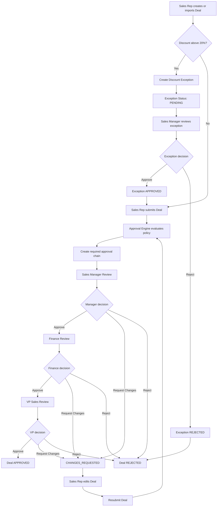

# DealFlow Business Workflow



## Example Workflow

A deal with:

- Deal value: $520,000
- Discount: 27%
- Margin: 13%

requires:

```text
Discount Exception
      |
Sales Manager Approval
      |
Finance Approval
      |
VP Sales Approval
      |
APPROVED
```

The deal cannot be submitted while the required discount exception is pending or rejected.

Once the exception is approved, the system creates the required sequential approval chain based on discount, margin, and deal value rules. Later approval stages cannot bypass earlier stages.
