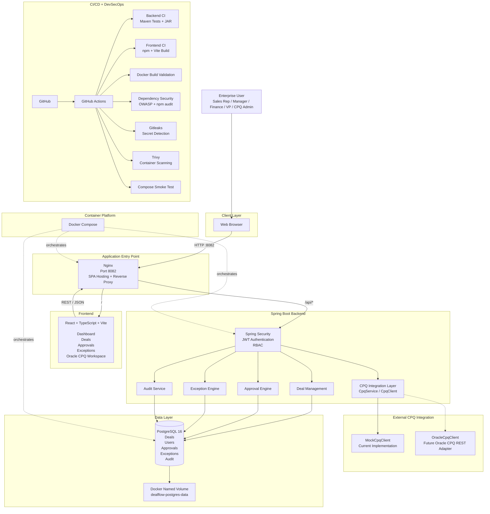

# DealFlow System Architecture

## Reading the Diagram

The browser reaches one public entry point at Nginx on port 8082. Nginx serves the React SPA and proxies `/api/*` requests to the Spring Boot backend. Spring Security authenticates requests with JWT and applies server-side RBAC before domain services handle deals, approvals, exceptions, audit events, and CPQ operations.

The CPQ integration is intentionally isolated behind `CpqService` and `CpqClient`. `MockCpqClient` is the current reproducible implementation; `OracleCpqClient` is the future adapter boundary for a real Oracle CPQ REST integration.

Docker Compose orchestrates the application containers, while PostgreSQL persists the domain data in the external `dealflow-postgres-data` named volume. GitHub Actions validates builds, dependencies, secrets, container images, and full-stack startup.
